# CARLA-based Adversarial AttackAssessment on Autonomous Vehicles (CARLA-A3)
This project is not maintained. It has been published as part of the following demo paper accepted for the VehicleSec 2024:  

```
@inproceedings{lan2024carla,
  title={CARLA-based Adversarial Attack Assessment on Autonomous Vehicles},
  author={Lan, Zirui and Choong, Wei Herng and Kao, Ching-Yu and Wang, Yi and Dehm, Mathias and Sperl, Philip and B{\"o}ttinger, Konstantin and Kasper, Michael},
  booktitle={Symposium on Vehicles Security and Privacy 2024},
  year={2024}
}
```
Our demo video is on YouTube! Watch it [here](https://www.youtube.com/watch?v=7C4aAekBbiE).

If you find our work useful, please cite our paper. Should you have any questions, feel free to reach out to one of the authors.

## Abstract

Autonomous vehicles rely on a combination of sensors and sophisticated artificial intelligence (AI) systems to perceive their surroundings. The increasing use of AI in autonomous driving technology has brought to our attention the concerns of the implications of AI failure. In this work, we chose an object detector (OD) as an entry point to study the robustness against adversarial attacks like malicious traffic signs. We design and implement CARLA-A3 (CARLA-based Adversarial Attack Assessment), which is a toolkit aimed to streamline the simulation of adversarial conditions and evaluation of OD with several robustness metrics. The toolkit can serve to rapidly and quantitatively evaluate the effects of a malicious sign presented to the OD.

## Prerequisites

The project was developed on a computer with the following specifications:
 |     |             |
 |-----|-------------|
 |CPU  | 13th Gen Intel® 32 Core™ i9-13900KF  |
 |GPU  | NVIDIA GeForce RTX 4090 / at least a 6 GB GPU although 8 GB is recommended |
 |RAM  | 32 GB                               |
 |OS (Local)   | Ubuntu 22.04 LTS                    |
 |Disk space   | ~300GB                    |

You can use these requirements as a guideline. For further information, check out [Carla system requirements](https://carla.readthedocs.io/en/latest/build_linux/#part-one-prerequisites).

### Docker and VS Code
Docker is required for running CARLA-A3. Please [install Docker](https://docs.docker.com/get-started/get-docker/) if you do not have it. See [post installation steps](https://docs.docker.com/engine/install/linux-postinstall/) to run Docker without `sudo`.

- **NOTE:** We use Visual Studio Code (VS Code) to set up and run CARLA-A3. If you are using another IDE, please adapt accordingly. 

## Setup
*The whole setup takes around 3 to 4 hours.* 

We launch VS Code and run following commands in the integrated terminal on VS Code. 

1. Clone this repository to your local workspace.
2. Download `carla.tar.xz` to `DockerBuildScript/dependencies`: 
    ```
    wget -O DockerBuildScript/dependencies/carla.tar.xz https://owncloud.fraunhofer.de/index.php/s/sEmE4sWAaCQwsAI/download
    ```
2. Download `frozen_inference_graph.pb` to `workingdir/details/faster_rcnn/faster_rcnn_inception_v2_coco_2017_11_08`:
     ```
    wget -O workingdir/details/faster_rcnn/faster_rcnn_inception_v2_coco_2017_11_08/frozen_inference_graph.pb https://owncloud.fraunhofer.de/index.php/s/HhhWysUuNXSfL55/download
    ```
2. Download `yolo.weights` to `workingdir/details/attack/adversarial_yolo_master/weights`:
    ```
    wget -O workingdir/details/attack/adversarial_yolo_master/weights/yolo.weights https://owncloud.fraunhofer.de/index.php/s/jT1CJW2IWPLo8Om/download
    ```
    You should now have the following directory structure:
    ```
    CARLA-A3 
    ├── DockerBuildScript
    |   └── dependencies
    |       └── carla.tar.xz
    ├── docs
    ├── media
    ├── results
    |── workingdir
    |   └── details
    |       └── faster_rcnn
    |       |    └── faster_rcnn_inception_v2_coco_2017_11_08
    |       |        └── frozen_inference_graph.pb
    |       └── attack
    |           └── adversarial_yolo_master
    |               └── weights
    |                   └── yolo.weights
    |── Makefile   
    └── README.md   
    ```
2. Create `CarlaVolume` and un-tar the Carla repo into `CarlaVolume`:
    ```
    mkdir CarlaVolume
    tar -xvf ./DockerBuildScript/dependencies/carla.tar.xz -C ./CarlaVolume
    ```
3. Run the below command to download Carla assets (takes approx. 20 mins). <br /> 
`CarlaVolume` *will be attached to the docker for saving any modifications made to Carla assets during execution.*
    ```
    ./CarlaVolume/carla/Update.sh
    ```

4. Move the custom materials from `media` to the Carla workspace inside `CarlaVolume`. <br />
*The custom materials ensure that the patches are rendered clearly.*

    ``` 
    mv ./media/BlankMaterial.uasset ./CarlaVolume/carla/Unreal/CarlaUE4/Content/Carla/
    mv ./media/M_BasicAdvStopSignPatch.uasset ./CarlaVolume/carla/Unreal/CarlaUE4/Content/Carla/
    ```
    
4. Fork the modified fork of Unreal Engine 4.26, which contains patches specific to CARLA, to `DockerBuildScript/dependencies`.<br /> 
For this step, you need to have a GitHub account linked to Unreal Engine's account. Please follow [this guide](https://www.unrealengine.com/en-US/ue-on-github).
    ```
    cd DockerBuildScript/dependencies
    git clone --depth 1 -b carla https://github.com/CarlaUnreal/UnrealEngine.git
    ```
5. Run the following command to build the docker image of CARLA-A3:
     ```
     make build-ue-carla
     ```
     **NOTE** 
     - The build process takes around 2 to 3 hours. At times the console may appear frozen and unresponsive.
     - The current build steps are specific to Carla 0.9.15. For a different version of Carla, please modify the build steps accordingly. 
 6. Running CARLA-A3 for the first time requires some initialization. Run the below command: 
    ```
    make run-init-carla         # Only run this line when running CARLA-A3 for the first time.
    ```
    This step launches CARLA-A3 as well. If you see the Carla UI along with a Carla map now, the setup is successful. <br /><br /> 
    To launch CARLA-A3 next time, use the command below: 
     ```
    make run-ue-carla           # Launch CARLA-A3 without initialization
    ```

# Running the Experiments
## Simulation 1: Clean Stop Sign
After launching CARLA-A3, we will now setup the Carla map `Town02` to run a simulation of car driving past a regular stop sign, with the `Faster RCNN Inception v2` object detection model running inference on the dashcam. 
### Setting up the Map and the Stop Sign
1. Open the level `Town02` in the Carla UI by `File > Open Level > Maps > Town02`.  
    <pre>
    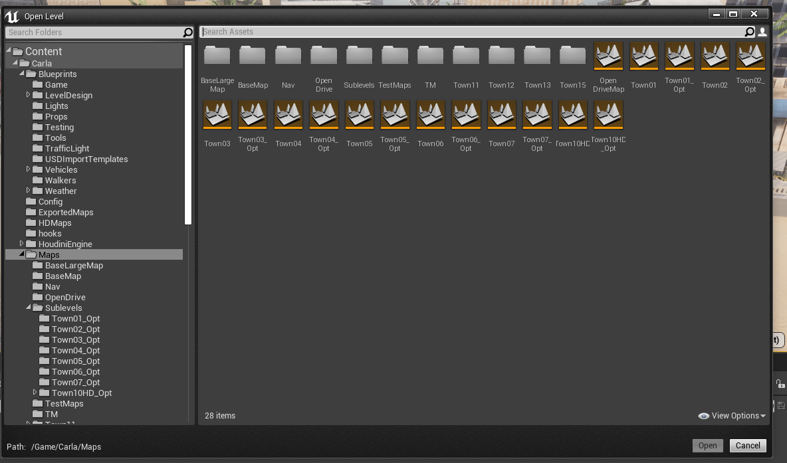        
    </pre>
2. In the Carla UI, go to the `Content Browser` tab at the bottom, select the blueprint `Content/Carla/Static/TrafficSign/BP_Stop`, drag and drop it onto the map `Town02`.
    <pre>
    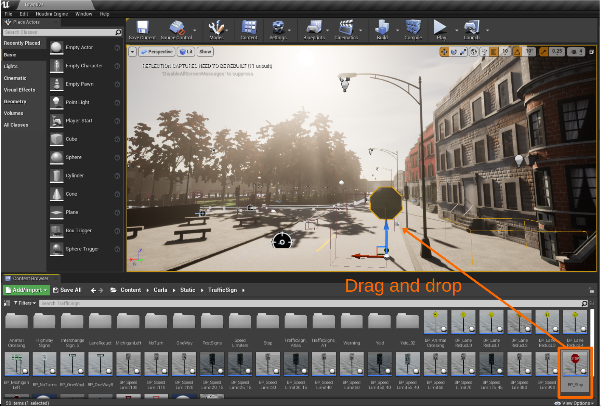        
    </pre>

3. In the `Details` tab on the right, set the `Transform` property values to the ones shown below:

    <pre>
    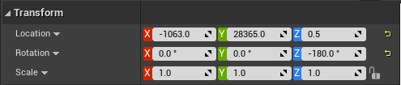        
    </pre>

4. Select the stop sign on the map. In the `World Outliner` tab, press `F2` and rename it to `advstopsign` (see figure below).</br >  This is done so that it can be recognized by the code.

    <pre>
    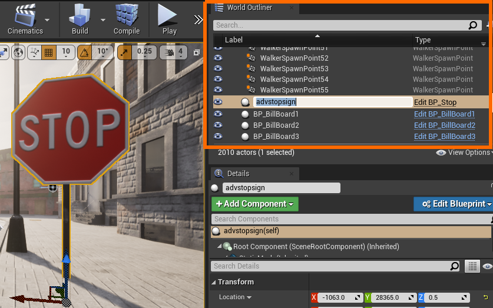        
    </pre>

### Running Clean Stop Sign Scenario

After setting up the map and the stop sign, we can now run simulations. Here, we show an example of running an experiment with a clean stop sign.

1. In the Carla UI, click the `Play` button (top right) to start the server. If a pop-up appears with the message ```Compiling Shaders```, wait until it finishes before running any Python scripts.
    <pre>
    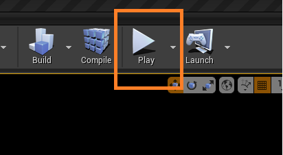        
    </pre>

2. Open a new window on VS Code and perform the following series of actions:
    1. Click on the blue icon at the bottom left to open a remote window 
    2. Select "Attach to a Running Container" 
    3. Select "/carla-ue" 

    This will open a new VSCode window connecting to the Carla container `carla-ue`.</br >
**NOTE:** Ensure the `Dev Containers` extension is installed.
3. Open a terminal in the new VSCode window and navigate to the directory `workingdir` in the attached container.
4. Run the following command to start the simulation:
    ```
    python3 CleanStopsign.py
    ```
    **NOTE**: While running the simulation, if you observe that the `Ground Truth` window is detecting the pole of the Stop Sign rather than the hexagonal sign board, you may have to edit [here](workingdir/details/SimLogic.py#L181). The figure below shows one frame of the dashboard camera view.
    <pre>
    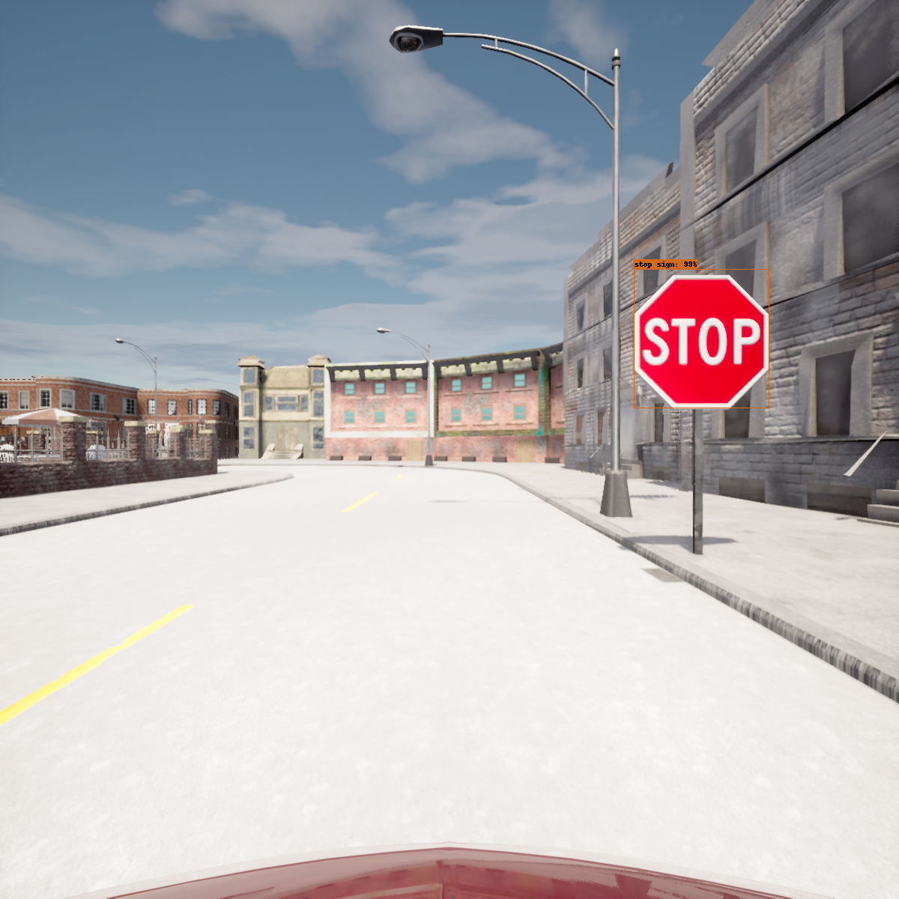   
    </pre>

### Logging Results
The simulation generates 3 log directories to store different results:
- `simlog` stores each simulation results in pickle files.
- `metlog` stores each simulation results in user readable html files.
- `complog` stores the plots summarizing the results.

## Simulation 2: Adversarial Stop Sign
The following steps explain how to setup the Carla map to run the attack simulations. In this example, we will show how to apply adversarial patches on the stop sign and setup `town 2` map for simulations. The adversarial patches in this repo are designed to attack the `Faster RCNN Inception v2` object detection model. 
### Setting up the Adversarial Stop Sign

1. Open the level `Town02` in the Carla UI by `File > Open Level > Maps > Town02`.   

3. In the Carla UI, go to the `Content Browser` tab below, click on the blueprint `Content/Carla/Static/TrafficSign/BP_Stop` and open it in the blueprint editor.

4. Edit the stop sign hexagon by following the steps below:
    1. Click on the `Viewport` tab (4.1 in the figure)
    2. Select the model of the stop sign by clicking on the stop sign hexagon in the UI, or select `StaticMesh1` from the `Components` tab (4.2 in the figure). 
    3. In the `Details` tab (4.3 in the figure) open the drop down menu inside the `Materials` property. Search and apply the material `BlankMaterial` to the stop sign hexagon.

        <pre>
        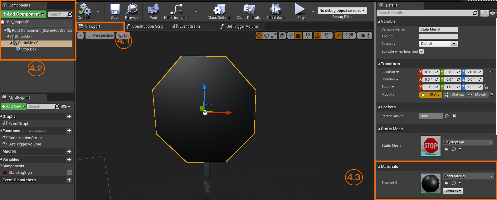        
        </pre>


5. Add a placeholder to apply the adversarial image:
    1. Under the `Components` tab (5.1 in the figure), click on `Add Component` and select a cube.
    2. Replicate all the values under the `Transform` property (5.1 in the figure) in the `Details` tab as shown below. This will scale the plane until it exactly covers the hexagonal stop sign and make it appear in front of the hexagon as shown below.
    3. In the `Details` tab (5.3 in the figure) open the drop down menu inside the `Materials` property. Search and apply the material `M_BasicAdvStopSignPatch` to the stop sign hexagon. The Python API will detect this material and apply the adversarial patch in its place. 
        <pre>
        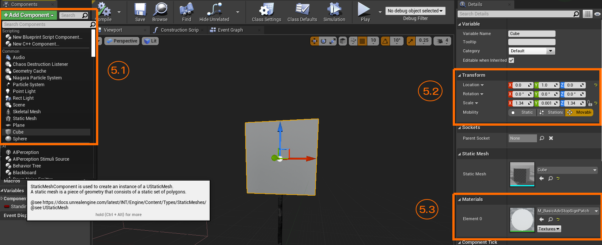        
        </pre>


6. Finally, save it as a new blueprint `File > Save As` and name it `BP_AdvStopSign`. Close the Blueprint Editor.

7. Select `BP_AdvStopSign` from the `Content Browser` tab at the bottom of the UI. Drag and drop the newly created stop sign onto the `Town02` map. In the `Details` tab on the right, set all the values under `Transform` to match the ones shown below.
    <pre>
    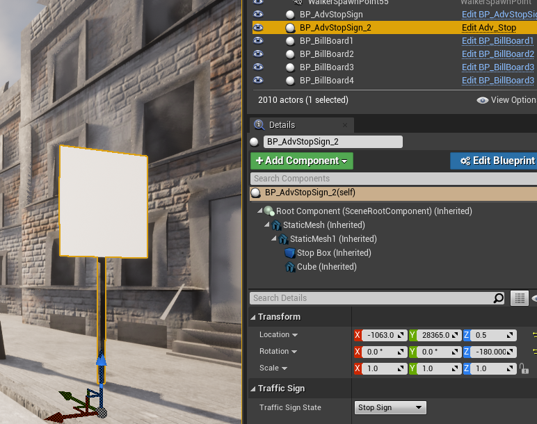
    </pre>

8. Under the `World Outliner` tab (top right), search for `BP_AdvStopSign` under the `Label` column. Place your cursor on `BP_AdvStopSign` to check the `ID name`. The `ID name` is used to identify the stop sign in the Python script. The default value used in the code is `BP_AdvStopSign_2`. If you see a different name, you can make the changes in the script [here](workingdir/details/injector.py#L49). 
    <pre>
    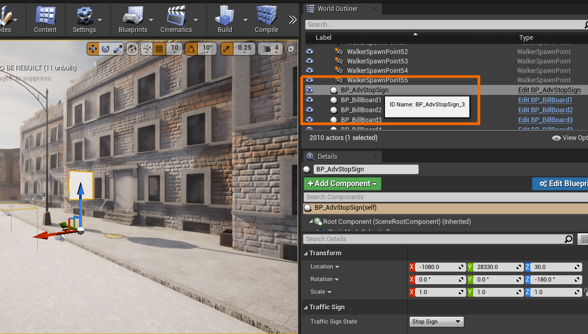        
    </pre>

9. Save the map by clicking on the save button on the top left.


### Running the Adversarial Attack Scenario

After preparing the map, follow the steps below to run the attack scenarios:


1. In the Carla UI, click on the `Play` button (top right), to start the server. </br> **NOTE**: After pressing "Play", if you notice a pop-up with the message `Compiling Shaders`, wait until it is finished before running any Python scripts.
    <pre>
            
    </pre>

2. Open a new window on VS Code and perform the following series of actions:
    1. Click on the blue icon at the bottom left to open a remote window 
    2. Select "Attach to a Running Container" 
    3. Select "/carla-ue" 
3. Open a terminal in the new VSCode window and navigate to the directory `workingdir` in the attached container.
4. Run the simulation with an adversarial patch by running the following line:

    ```
    python3 AdvStopsign.py 
    ```
    If you want to run the simulation using your own adversarial patch or a patch from the repo, run the following line:

    ```
    python3 AdvStopsign.py -p data/Chen_Patch_1.png     # the patch should be in the data dir
    ```
    The figure below shows one frame of the dashboard camera view.

    <pre>
    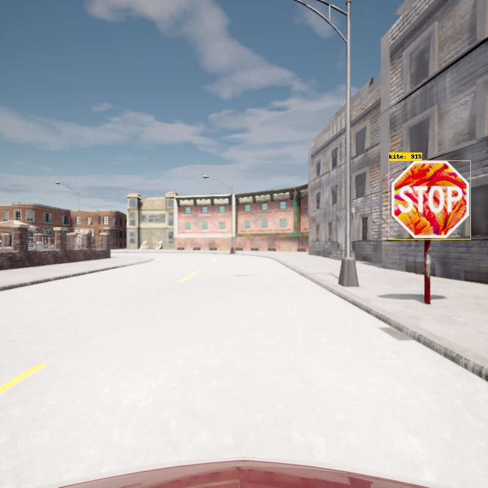   
    </pre>
    **NOTE**: While running the simulation, if you observe that the ground truth is detecting the "pole" of the stop sign rather than the hexagonal sign board, edit [here](workingdir/details/SimLogic.py#L181). 

The generated simulation results are stored in `simlog`, `metlog` and `complog`.

## Further Experiments 

### Different Adversarial Textures Comparison

This experiment demonstrates a pipeline of multiple runs, each rendering a different adversarial texture on the stop sign, followed by a comparison of metrics across runs. 
The following line runs the simulation with all image files in the given directory:
```
python3 DiffAdvPatchComp.py -d ./data
```
### Different Camera Resolution Comparison

This experiment demonstrates the pipeline of multiple runs, each having a different resolution setting for the in-vehicle camera, followed by a comparison of metrics of multiple runs. You can modify the list of resolution values [here](workingdir/DiffCamResComp.py#L15). Run the below Python script to start the experiment:

```
python3 DiffCamResComp.py
```

### Different Environmental Condition Comparison

This experiment demonstrates the pipeline of multiple runs, each having a different environmental condition, followed by a comparison of metrics of multiple runs. You can choose from a list of preset weather conditions available [here](workingdir/DiffEnvComp.py#L19). Run the below Python script to start the experiment:

```
python3 DiffEnvComp.py
```


### Attack Texture Generation

New adversarial textures can be generated using the attack module. After generation, the textures can be rendered on the stop sign and the attack effectiveness can be evaluated using the Python scripts introduced earlier. The generated adversarial patch using the current attack module is targeted against the `YOLOv2 MS COCO` object detection model. 

Run the below script to generate a patch using one of the example images:

```
python3 GenAdvPatch.py
```
You can also select an image for the generation:
```
python3 GenAdvPatch.py -p advpatch/advbase1.jpg
```
During the generation of adversarial texture, a window will pop up showing the evolution of texture.

## Appendix

### Results from our Experiment

The CARLA-A3 in this repository uses Carla version 0.9.15, while the results from our paper were obtained using Carla version 0.9.13. We have rerun the experiments with the current CARLA-A3 and documented the observations from each scenario [here](results/results.md). We compared these observations with those from our [original experiments](https://www.youtube.com/watch?v=7C4aAekBbiE). 

### Building Custom Materials

The materials `/media/BlankMaterial.uasset` and `/media/M_BasicAdvStopSignPatch.uasset` can also be created using the material editor by following the property graph of each material as shown below:

<pre>
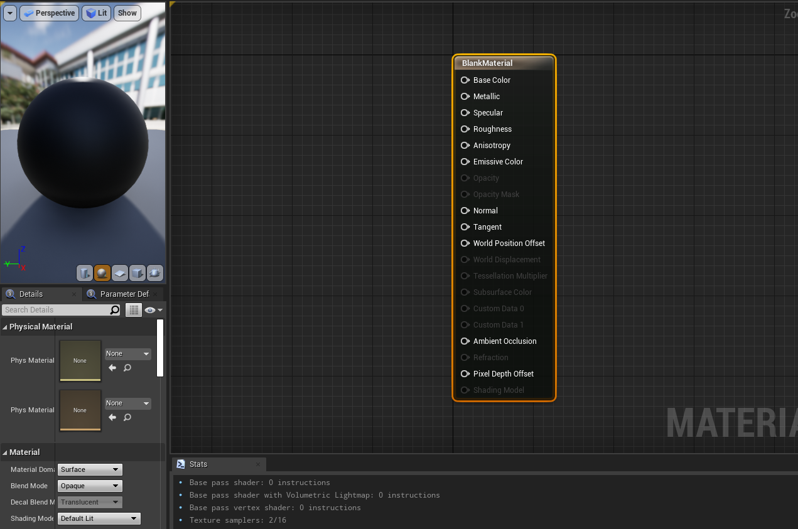        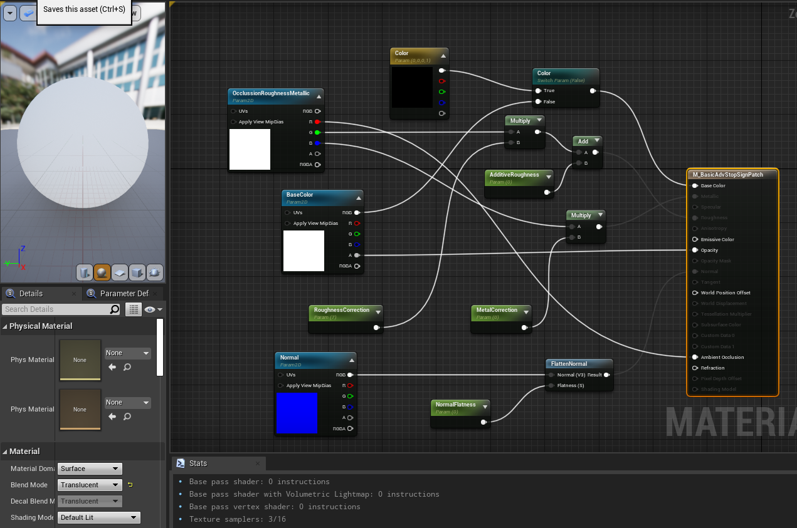
</pre>

### Changing Stop Sign Location

 If you'd like to change the location of the Adversarial Stop Sign, update the coordinates of the spawn point of the car in [script](workingdir/details/SimLogic.py#L79) accordingly. Note that you'd have to convert the coordinates as  ```  Python_API Co-ordinates = Carla coordinates * 0.01```. 
 
 **NOTE**: Consider the position and orientation of the car relative to the stop sign when changing the coordinates. This might require some trial and testing to find the right coordinates.

## Known Issues 
 1. While running the simulation, if you observe that the ground truth is detecting the "pole" of the stop sign rather than the hexagonal sign board, you may have to edit [here](workingdir/details/SimLogic.py#L181). 
 2. If you find that while installing Unreal Engine, running "Setup.sh" results in the error "Linux is not a valid platform to build". You would have to manually install the Toolchain following [this](https://forums.unrealengine.com/t/error-plataform-linux-is-not-valid-platform-to-build/471670/3) solution.
 3. If you run into an error when connecting to the Carla container via Visual Studio Code, make sure the VSCode extension "Dev Containers" is updated.
 4. If you observe that the image applied on the Stop Sign is rotated by an angle, you can orient it at this [line](workingdir/details/injector.py#L34).

